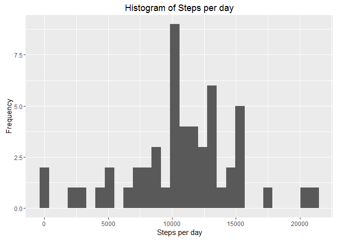
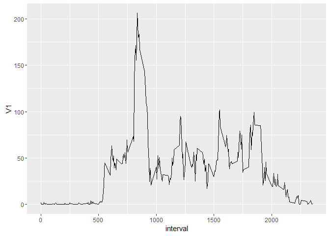
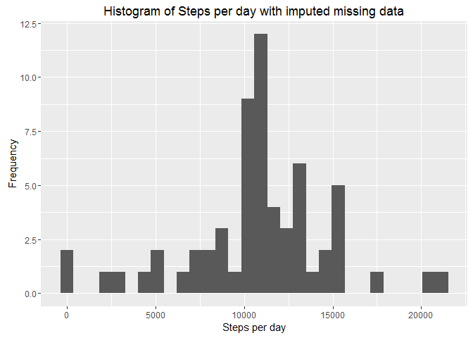
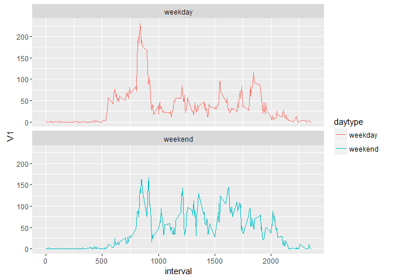

# Reproducible Research: Peer Assessment 1
KamalC  
07/16/2016  

## Background

Part of [Coursera Reproducible Research course , Peer Assessment 1](https://www.coursera.org/learn/reproducible-research/peer/gYyPt/course-project-1). Refer to readme file for more details.
 
##  Loading and preprocessing the data

*Load ggplot2 & plyr for graphing & data subsetting*


```r
library(ggplot2)
library(plyr)
```

*Load the data (i.e. read.csv())*


```r
if(!file.exists("activity.csv")) 
  unzip("activity.zip")
activity.df <- read.csv("activity.csv", stringsAsFactors = FALSE)
```

*Process/transform the data (if necessary) into a format suitable for your analysis* 
Changing date from string to Date type.

```r
activity.df$date <- as.Date(activity.df$date, "%Y-%m-%d")
str(activity.df)
```

```
## 'data.frame':	17568 obs. of  3 variables:
##  $ steps   : int  NA NA NA NA NA NA NA NA NA NA ...
##  $ date    : Date, format: "2012-10-01" "2012-10-01" ...
##  $ interval: int  0 5 10 15 20 25 30 35 40 45 ...
```

```r
summary(activity.df)
```

```
##      steps             date               interval     
##  Min.   :  0.00   Min.   :2012-10-01   Min.   :   0.0  
##  1st Qu.:  0.00   1st Qu.:2012-10-16   1st Qu.: 588.8  
##  Median :  0.00   Median :2012-10-31   Median :1177.5  
##  Mean   : 37.38   Mean   :2012-10-31   Mean   :1177.5  
##  3rd Qu.: 12.00   3rd Qu.:2012-11-15   3rd Qu.:1766.2  
##  Max.   :806.00   Max.   :2012-11-30   Max.   :2355.0  
##  NA's   :2304
```


## What is mean total number of steps taken per day?

*Make a histogram of the total number of steps taken each day*


```r
stepsperday.df <- ddply(activity.df[!is.na(activity.df$steps),], "date", function(df)sum(df$steps))
ggplot(stepsperday.df, aes(x = V1)) +
  geom_histogram() +
  labs(title = "Histogram of Steps per day", x = "Steps per day", y = "Frequency")
```

```
## `stat_bin()` using `bins = 30`. Pick better value with `binwidth`.
```

<!-- -->

*Calculate and report the mean and median total number of steps taken per day*


```r
stepsperday.mean <- mean(stepsperday.df$V1)
stepsperday.median <- median(stepsperday.df$V1)
```

Mean steps per day: 1.0766189\times 10^{4}.
Median steps per day: 10765.

## What is the average daily activity pattern?

*Make a time series plot (i.e. type = "l") of the 5-minute interval (x-axis) and the average number of steps taken, averaged across all days (y-axis)*

```r
meanstepsperinterval.df <- ddply(activity.df[!is.na(activity.df$steps),], "interval", function(df)mean(df$steps))
ggplot(meanstepsperinterval.df, aes(x=interval, y=V1)) +
  geom_line()
```

<!-- -->

*Which 5-minute interval, on average across all the days in the dataset, contains the maximum number of steps?*

```r
maxinterval.df <- meanstepsperinterval.df[which.max(meanstepsperinterval.df$V1),]
```

Interval 835 has maximum number of steps on avergare at  206.1698113 steps/day.

## Imputing missing values

*Calculate and report the total number of missing values in the dataset (i.e. the total number of rows with NAs)*

```r
sum(is.na(activity.df$steps))
```

```
## [1] 2304
```

*Devise a strategy for filling in all of the missing values in the dataset. The strategy does not need to be sophisticated. For example, you could use the mean/median for that day, or the mean for that 5-minute interval, etc.*
*Create a new dataset that is equal to the original dataset but with the missing data filled in.*

Using mean for that 5 minute interval across all days which we calculated earlier in analysis. It didn't have any NAs for any timestamps

```r
activity.full.df <- activity.df
summary(activity.full.df)
```

```
##      steps             date               interval     
##  Min.   :  0.00   Min.   :2012-10-01   Min.   :   0.0  
##  1st Qu.:  0.00   1st Qu.:2012-10-16   1st Qu.: 588.8  
##  Median :  0.00   Median :2012-10-31   Median :1177.5  
##  Mean   : 37.38   Mean   :2012-10-31   Mean   :1177.5  
##  3rd Qu.: 12.00   3rd Qu.:2012-11-15   3rd Qu.:1766.2  
##  Max.   :806.00   Max.   :2012-11-30   Max.   :2355.0  
##  NA's   :2304
```

```r
activity.full.df$steps[is.na(activity.df$steps)] <- meanstepsperinterval.df[ match(activity.df$interval[is.na(activity.df$steps)], meanstepsperinterval.df$interval), "V1"]
summary(activity.full.df)
```

```
##      steps             date               interval     
##  Min.   :  0.00   Min.   :2012-10-01   Min.   :   0.0  
##  1st Qu.:  0.00   1st Qu.:2012-10-16   1st Qu.: 588.8  
##  Median :  0.00   Median :2012-10-31   Median :1177.5  
##  Mean   : 37.38   Mean   :2012-10-31   Mean   :1177.5  
##  3rd Qu.: 27.00   3rd Qu.:2012-11-15   3rd Qu.:1766.2  
##  Max.   :806.00   Max.   :2012-11-30   Max.   :2355.0
```

*Make a histogram of the total number of steps taken each day and Calculate and report the mean and median total number of steps taken per day. Do these values differ from the estimates from the first part of the assignment? What is the impact of imputing missing data on the estimates of the total daily number of steps?*


```r
stepsperday.full.df <- ddply(activity.full.df, "date", function(df)sum(df$steps))
ggplot(stepsperday.full.df, aes(x = V1)) +
  geom_histogram() +
  labs(title = "Histogram of Steps per day with imputed missing data", x = "Steps per day", y = "Frequency")
```

```
## `stat_bin()` using `bins = 30`. Pick better value with `binwidth`.
```

<!-- -->

```r
stepsperday.full.mean <- mean(stepsperday.full.df$V1)
stepsperday.full.median <- median(stepsperday.full.df$V1)
stepsperday.full.meanchange <- stepsperday.full.mean - stepsperday.mean
stepsperday.full.medianchange <- stepsperday.full.median - stepsperday.median
```

Mean steps per day with imputed missing data: 1.0766189\times 10^{4} (Change: 0).
Median steps per day with imputed missing data: 1.0766189\times 10^{4} (Change: 1.1886792).

**Mean didn't change, but median became similar to mean.**

## Are there differences in activity patterns between weekdays and weekends?

*Create a new factor variable in the dataset with two levels -- "weekday" and "weekend" indicating whether a given date is a weekday or weekend day.*


```r
activity.full.df$daytype = as.factor(
        ifelse(
          weekdays(activity.full.df$date) == "Saturday" |  weekdays(activity.full.df$date) == "Sunday",
          "weekend",
          "weekday"
          )
        )
```

*Make a panel plot containing a time series plot (i.e. type = "l") of the 5-minute interval (x-axis) and the average number of steps taken, averaged across all weekday days or weekend days (y-axis).*


```r
meanstepsperintervaldaytype.df <- ddply(activity.full.df, c("interval","daytype"), function(df)mean(df$steps))
ggplot(meanstepsperintervaldaytype.df, aes(x=interval, y=V1, color=daytype)) +
  geom_line() +
  facet_wrap(~daytype, ncol=1, nrow=2)
```

<!-- -->

  
Looking at the activity pattern across interval it seems weekends are having more activity during middle of the day & slightly less activity on average during morning.
